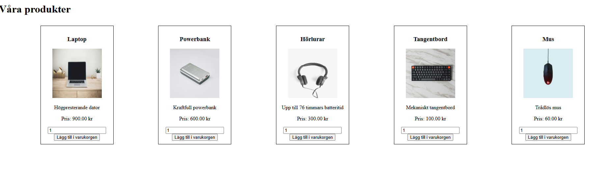
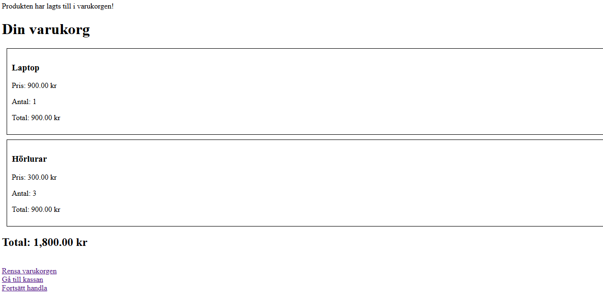
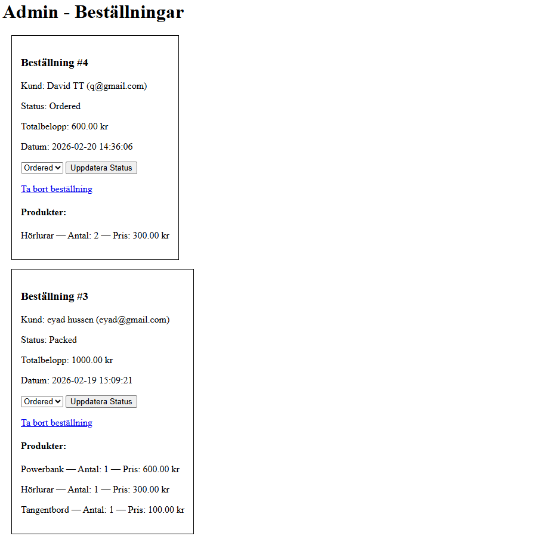

# 🛒 Webshop-php-mysql

A full-stack webshop built with **PHP** and **MySQL**, containerized with **Docker**. Customers can browse products, manage a cart, and place orders. The store owner has an admin panel to manage all incoming orders.

---

## 📸 Preview

| Shop | Cart | Admin |
|---|---|---|
|  |  |  |

---

## 🚀 Built With

| Technology | Usage |
|---|---|
| PHP 8.2 | Server-side logic, sessions, form handling |
| MySQL 8.0 | Database — products, customers, orders |
| HTML5 | Frontend structure |
| Docker + Docker Compose | Local dev environment |
| phpMyAdmin | Database management UI |

---

## ✅ Features

### 🛍️ Customer Side
- Browse all available products with image, description and price
- Add products to cart with quantity selector
- Cart managed via **PHP Sessions**
- Clear cart or continue shopping
- Checkout form with full customer details
- Customer automatically saved to DB on order
- Error message if required fields are missing
- Confirmation message after successful order

### 🔧 Admin Panel
- View all orders sorted by date (newest first)
- See customer info and ordered products per order
- Update order status: `Ordered` → `Packed` → `Shipped` → `Paid`
- Delete an order (cascades to order_items)

---

## 🗄️ Database Structure

```sql
customers
├── id (PK, AUTO_INCREMENT)
├── firstname
├── lastname
├── phone
├── address
├── zipcode
├── city
├── email
└── created_at (DEFAULT CURRENT_TIMESTAMP)

products
├── id (PK, AUTO_INCREMENT)
├── name
├── description
├── price
└── image

orders
├── id (PK, AUTO_INCREMENT)
├── customer_id  →  customers.id (ON DELETE CASCADE)
├── status       ENUM('Ordered','Packed','Shipped','Paid')
├── order_date   (DEFAULT CURRENT_TIMESTAMP)
└── total_amount

order_items
├── id (PK, AUTO_INCREMENT)
├── order_id     →  orders.id (ON DELETE CASCADE)
├── product_id   →  products.id
├── quantity
└── amount
```

---

## 🛍️ Products (seeded in DB)

| # | Product | Description | Price |
|---|---|---|---|
| 1 | Laptop | Högpresterande dator | 900 kr |
| 2 | Powerbank | Kraftfull powerbank | 600 kr |
| 3 | Hörlurar | Upp till 76 timmars batteritid | 300 kr |
| 4 | Tangentbord | Mekaniskt tangentbord | 100 kr |
| 5 | Mus | Trådlös mus | 60 kr |

---

## 📁 Project Structure

```
klasses-webshop/
├── src/
│   ├── index.php          # Product listing
│   ├── cart.php           # Shopping cart (session-based)
│   ├── checkout.php       # Order form + DB insert
│   ├── admin.php          # Admin panel
│   ├── database.php       # DB connection
│   └── images/            # Product images
│       ├── laptop.jpg
│       ├── powerbank.jpg
│       ├── headphones.jpg
│       ├── keyboard.jpg
│       └── mouse.jpg
├── webbshopDB.sql         # Database schema + seed data
├── mysql.dockerfile       # PHP + Apache image with mysqli
├── docker-compose.yml     # PHP + MySQL + phpMyAdmin
└── README.md
```

---

## 🚦 Order Status Flow

```
Ordered  →  Packed  →  Shipped  →  Paid
```

---

## ⚙️ Setup & Installation

### Requirements
- [Docker Desktop](https://www.docker.com/products/docker-desktop)

### Steps

1. Clone the repo
```bash
git clone https://github.com/Eyadho/webshop-php-mysql.git
cd webshop-php-mysql
```

2. Start Docker Desktop and wait until the engine is running

3. Start the containers
```bash
docker-compose up -d
```

4. Open the webshop → http://localhost:8080

---

## 📋 Assignment Requirements

Built as part of the **Webbutveckling** course at GRIT Academy.

| Requirement | Status |
|---|---|
| Product listing page | ✅ |
| Add to cart and place order | ✅ |
| Customer saved automatically on order | ✅ |
| Error handling — missing fields | ✅ |
| Order confirmation message | ✅ |
| Admin — list all orders sorted by date | ✅ |
| Admin — delete order | ✅ |
| Admin — update order status | ✅ |
| SQL: INSERT, UPDATE, DELETE, SELECT | ✅ |
| Minimum 5 products in DB | ✅ |
| Foreign keys with CASCADE | ✅ |

---

## 👤 Author

**Eyad Hussen**  
Webbutveckling med inriktning UX & E-handel  
[LinkedIn](#) · [GitHub](#)
